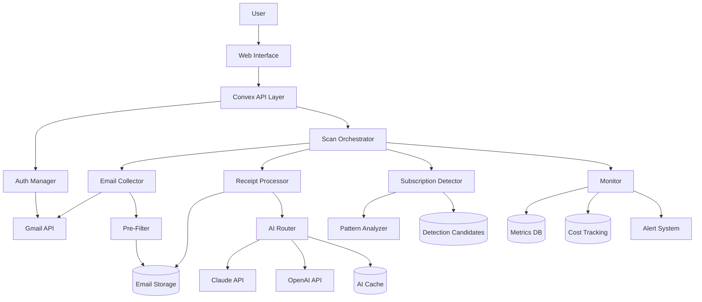

# SUBSCRIPTION DETECTION SYSTEM ARCHITECTURE

## **HIGH-LEVEL ARCHITECTURE**



## **COMPONENT BREAKDOWN**

### **1. SCAN ORCHESTRATOR**
Central coordinator managing the entire scan lifecycle.

```typescript
// convex/scanning/orchestrator.ts
interface ScanOrchestrator {
  // Lifecycle Management
  initiateScan(connectionId: Id, type: 'full' | 'incremental'): ScanSession
  resumeScan(sessionId: Id): void
  pauseScan(sessionId: Id): void
  failScan(sessionId: Id, error: Error): void

  // State Transitions (Atomic)
  transitionState(sessionId: Id, newState: ScanState): void
  validateTransition(from: ScanState, to: ScanState): boolean

  // Checkpointing
  saveCheckpoint(sessionId: Id, checkpoint: Checkpoint): void
  loadCheckpoint(sessionId: Id): Checkpoint

  // Progress Tracking
  updateProgress(sessionId: Id, progress: Progress): void
  broadcastProgress(sessionId: Id): void
}
```

### **2. EMAIL COLLECTOR**
Handles Gmail API interaction and email retrieval.

```typescript
// convex/scanning/collector.ts
interface EmailCollector {
  // Connection Management
  validateConnection(connectionId: Id): ConnectionStatus
  refreshTokenIfNeeded(connectionId: Id): void

  // Email Collection
  buildQuery(type: 'full' | 'incremental', lastSyncAt?: Date): string
  fetchEmails(query: string, pageToken?: string): EmailBatch

  // Deduplication
  deduplicateEmails(emails: Email[]): Email[]
  hashEmail(email: Email): string

  // Storage
  storeEmails(sessionId: Id, emails: Email[]): void

  // Rate Limiting
  respectRateLimit(): void
  handleQuotaExceeded(): void
}
```

### **3. PRE-FILTER**
Eliminates non-receipts before expensive AI processing.

```typescript
// convex/scanning/filter.ts
interface PreFilter {
  // Filtering Rules
  isLikelyReceipt(email: Email): boolean
  extractReceiptSignals(email: Email): SignalSet

  // Merchant Detection
  detectKnownMerchant(email: Email): Merchant | null
  isFromReceiptDomain(sender: string): boolean

  // Content Analysis
  hasTransactionKeywords(body: string): boolean
  hasAmountPattern(body: string): boolean
  hasBillingCycle(body: string): boolean

  // Classification
  classifyEmail(email: Email): EmailType
  confidenceScore(signals: SignalSet): number
}

// Filtering rules with 99% accuracy
const RECEIPT_SIGNALS = {
  required: ['amount', 'merchant'],
  optional: ['date', 'invoice', 'receipt', 'order'],
  negative: ['unsubscribe', 'newsletter', 'welcome']
}
```

### **4. RECEIPT PROCESSOR**
Manages AI processing with optimization and caching.

```typescript
// convex/ai/processor.ts
interface ReceiptProcessor {
  // Batch Management
  createBatches(receipts: Receipt[], batchSize: number): Batch[]
  groupByMerchant(receipts: Receipt[]): Map<Merchant, Receipt[]>

  // AI Processing
  processWithAI(batch: Batch): ParsedReceipt[]
  routeToProvider(receipt: Receipt): 'claude' | 'openai'

  // Optimization
  extractRelevantContent(email: Email): string
  truncateToTokenLimit(content: string, limit: number): string
  estimateTokens(content: string): number

  // Caching
  getCachedResult(contentHash: string): ParsedReceipt | null
  cacheResult(contentHash: string, result: ParsedReceipt): void

  // Validation
  validateAIResponse(response: any): ParsedReceipt
  normalizeAmount(amount: string): number
}
```

### **5. SUBSCRIPTION DETECTOR**
Identifies recurring subscriptions from parsed receipts.

```typescript
// convex/detection/detector.ts
interface SubscriptionDetector {
  // Pattern Analysis
  analyzeRecurrencePattern(receipts: ParsedReceipt[]): Pattern
  calculateBillingCycle(dates: Date[]): BillingCycle
  detectAmountChanges(amounts: number[]): PriceHistory

  // Confidence Scoring
  calculateConfidence(evidence: Evidence): number
  weightedScore(factors: ScoringFactors): number

  // Duplicate Detection
  findDuplicates(candidates: Candidate[]): DuplicateSet[]
  mergeCandidates(duplicates: DuplicateSet): Candidate

  // Candidate Creation
  createCandidate(pattern: Pattern): DetectionCandidate
  enrichWithMetadata(candidate: Candidate): EnrichedCandidate
}
```

### **6. STATE MACHINE**
Manages scan lifecycle with atomic transitions.

```typescript
// convex/core/stateMachine.ts
enum ScanState {
  IDLE = 'idle',
  CONNECTING = 'connecting',
  COLLECTING = 'collecting',
  FILTERING = 'filtering',
  PARSING = 'parsing',
  DETECTING = 'detecting',
  REVIEWING = 'reviewing',
  COMPLETE = 'complete',
  FAILED = 'failed',
  PAUSED = 'paused'
}

const STATE_TRANSITIONS = {
  [ScanState.IDLE]: [ScanState.CONNECTING],
  [ScanState.CONNECTING]: [ScanState.COLLECTING, ScanState.FAILED],
  [ScanState.COLLECTING]: [ScanState.FILTERING, ScanState.FAILED, ScanState.PAUSED],
  [ScanState.FILTERING]: [ScanState.PARSING, ScanState.FAILED],
  [ScanState.PARSING]: [ScanState.DETECTING, ScanState.FAILED, ScanState.PAUSED],
  [ScanState.DETECTING]: [ScanState.REVIEWING, ScanState.FAILED],
  [ScanState.REVIEWING]: [ScanState.COMPLETE, ScanState.FAILED],
  [ScanState.FAILED]: [ScanState.IDLE],
  [ScanState.PAUSED]: [ScanState.COLLECTING, ScanState.PARSING]
}
```

### **7. ERROR HANDLING**
Comprehensive error management with recovery strategies.

```typescript
// convex/core/errors.ts
enum ErrorType {
  TRANSIENT = 'transient',     // Retry with backoff
  PERMANENT = 'permanent',     // Fail fast
  PARTIAL = 'partial',         // Continue with others
  CRITICAL = 'critical'        // Stop everything
}

interface ErrorHandler {
  categorize(error: Error): ErrorType
  shouldRetry(error: Error, attempt: number): boolean
  getBackoff(attempt: number): number

  handleTransient(error: Error, context: Context): void
  handlePermanent(error: Error, context: Context): void
  handlePartial(error: Error, context: Context): void
  handleCritical(error: Error, context: Context): void

  logError(error: Error, level: LogLevel): void
  alertIfNeeded(error: Error): void
}

// Exponential backoff with jitter
const backoff = (attempt: number): number => {
  const base = Math.min(1000 * Math.pow(2, attempt), 30000)
  const jitter = Math.random() * 0.1 * base
  return base + jitter
}
```

### **8. MONITORING SYSTEM**
Real-time metrics, cost tracking, and alerting.

```typescript
// convex/monitoring/monitor.ts
interface MonitoringSystem {
  // Metrics
  recordMetric(name: string, value: number, tags?: Tags): void
  incrementCounter(name: string, tags?: Tags): void
  recordDuration(name: string, duration: number): void

  // Cost Tracking
  recordAPICall(provider: string, tokens: number, cost: number): void
  getCostForSession(sessionId: Id): CostBreakdown
  projectCost(emailCount: number): CostEstimate

  // Alerting
  checkThresholds(metrics: Metrics): Alert[]
  sendAlert(alert: Alert): void

  // Analytics
  getDetectionRate(timeRange: TimeRange): number
  getAverageProcessingTime(): number
  getProviderPerformance(): ProviderStats
}
```

## **DATA FLOW**

### **1. Scan Initiation**
```
User clicks "Scan"
→ Check for active scans (distributed lock)
→ Create ScanSession
→ Transition to CONNECTING
→ Validate Gmail connection
→ Refresh token if needed
```

### **2. Email Collection**
```
Transition to COLLECTING
→ Build search query (full/incremental)
→ Fetch emails in batches (with pagination)
→ Deduplicate by messageId
→ Store with session reference
→ Update checkpoint after each batch
```

### **3. Filtering**
```
Transition to FILTERING
→ Load unfiltered emails
→ Apply pre-filter rules
→ Classify email types
→ Mark receipts for processing
→ Update statistics
```

### **4. AI Processing**
```
Transition to PARSING
→ Load filtered receipts
→ Check AI cache
→ Create smart batches
→ Route to AI provider
→ Validate responses
→ Store parsed data
→ Update costs
```

### **5. Detection**
```
Transition to DETECTING
→ Group receipts by merchant
→ Analyze patterns
→ Calculate confidence
→ Create candidates
→ Merge duplicates
→ Prepare for review
```

### **6. Review & Completion**
```
Transition to REVIEWING
→ Present candidates to user
→ Process user actions
→ Create subscriptions
→ Update statistics
→ Transition to COMPLETE
```

## **KEY DESIGN DECISIONS**

### **1. Distributed Locking**
- Use Convex's built-in transaction support
- Implement lease-based locking for long operations
- Automatic lock release on timeout

### **2. Checkpoint System**
- Save progress after each significant step
- Include enough state to resume exactly
- Clean up old checkpoints automatically

### **3. Caching Strategy**
- Content-based cache (SHA-256 hash)
- Provider-specific response cache
- TTL: 30 days for AI responses
- LRU eviction when size limit reached

### **4. Cost Optimization**
- Pre-filter eliminates 90%+ non-receipts
- Smart batching reduces API calls by 5x
- Provider routing based on performance
- Token limit optimization per receipt type

### **5. Scalability**
- Horizontal scaling via worker distribution
- Database indexes on all query patterns
- Pagination for all list operations
- Streaming for large result sets

## **PERFORMANCE TARGETS**

| Metric | Target | Current |
|--------|--------|---------|
| Emails/minute | 500+ | ~50 |
| Detection accuracy | 95%+ | ~60% |
| False positive rate | <2% | ~10% |
| Cost per 1000 emails | <$0.10 | ~$3.30 |
| Crash recovery time | <10s | Never recovers |
| Concurrent scans | Unlimited | Breaks at 2+ |
| Memory usage | <100MB | Unbounded |

## **SECURITY CONSIDERATIONS**

1. **Token Storage**: Encrypt at rest using AES-256
2. **API Keys**: Rotate monthly, store in environment
3. **User Data**: Never log PII, hash sensitive content
4. **Rate Limiting**: Implement per-user quotas
5. **Input Validation**: Sanitize all user inputs
6. **CORS**: Restrict to application domain only

## **DEPLOYMENT ARCHITECTURE**

```
Production Environment
├── Convex Cloud (Backend)
│   ├── Functions (Serverless)
│   ├── Database (Managed)
│   └── Scheduled Jobs (Cron)
├── Vercel (Frontend)
│   ├── Next.js App
│   └── Edge Functions
└── External Services
    ├── Gmail API
    ├── Claude API
    └── OpenAI API
```

---

This architecture provides a solid foundation for a professional-grade subscription detection system that can scale to thousands of users while maintaining high accuracy and low costs.